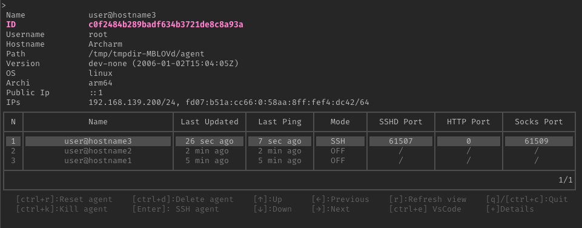

# Goauld

[Goauld full documentation](https://hazegard.github.io/Goauld-doc/)
> Goauld is a post-exploitation and remote access tool designed for restricted environments.

During penetration tests, operators are sometimes forced to work from a client-provided laptop behind VPNs, authenticated egress proxies, or restrictive network controls. In other cases, gaining remote code execution on a system still requires establishing a stable and fully interactive access channel.

Goauld solves these problems by providing a tunneling and access tool that allows operators to interact with remote agents through multiple transport protocols while maintaining a secure SSH-based architecture.

This tool aims to solve these two use cases.
It is composed of three components:
- The **server**: exposes an SSH server both directly and through multiple tunneling transports
- The **agent**: runs on the target host, and embeds an SSH server, SOCKS and HTTP proxies
- The **client**: used by the operator to access agents and manage sessions

## Use cases

- Post-exploitation remote access
- Pivoting through compromised hosts
- Working from restricted corporate assessment laptops
- Bypassing authenticated proxies

## Features

The main agent features are:
- SSH encapsulation over multiple transports:
    * Direct SSH
    * TLS
    * QUIC
    * WebSocket
    * HTTP
    * DNS
- Support for egress proxies with automatic NTLM/Kerberos authentication if required by the proxy
- Automatic NTLM/Kerberos application-level authentication when required by the target application
- Exposes SOCKS and HTTP proxies (which can themselves operate through upstream HTTP proxies)
- Fully interactive shell access
- File transfer via integrated SCP, Rsync, or Rclone
- TUN interface using an embedded WireGuard implementation
- Remote socket binding and listening on the agent
- Agent relaying

## Demo

[Demo.webm](https://github.com/user-attachments/assets/1e9eb332-174d-4ccf-a905-08614e720b86)

The architecture is based on an outbound SSH tunnel established from the agent to the server.
All communications are encapsulated within this tunnel, simplifying network traversal while preserving security and segmentation.

## Acknowledgments

This project takes inspiration from several tools:
- [Chisel](https://github.com/jpillora/chisel)
- [DNSTT](https://www.bamsoftware.com/software/dnstt/)
- [Champa](https://www.bamsoftware.com/git/champa.git/)
- [Ligolo-ng](https://github.com/nicocha30/ligolo-ng)
- [gVisor](https://pkg.go.dev/gvisor.dev/gvisor)
